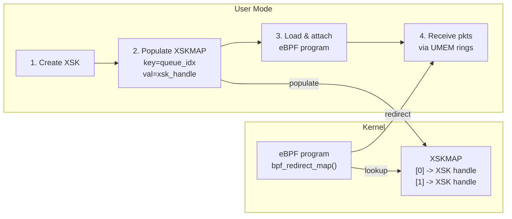

# eBPF Redirect Map (XSKMAP)

## Overview

The **XSKMAP** (`BPF_MAP_TYPE_XSKMAP`) is a specialized eBPF map type that
enables XDP eBPF programs to redirect packets to
[AF_XDP](afxdp.md) sockets. It is the primary mechanism for delivering
wire-rate packet data to user-mode applications when using eBPF programs with
XDP for Windows.

User mode creates AF_XDP sockets (XSKs), populates the XSKMAP with socket
handles keyed by RX queue index, and the eBPF program calls
`bpf_redirect_map()` to steer matching packets into the appropriate socket.



## Map Definition

Declare the XSKMAP in your eBPF program using the BTF-style map syntax:

```c
struct {
    __uint(type, BPF_MAP_TYPE_XSKMAP);
    __type(key, uint32_t);
    __type(value, void *);
    __uint(max_entries, 64);
} xsk_map SEC(".maps");
```

| Field | Value | Description |
|-------|-------|-------------|
| `type` | `BPF_MAP_TYPE_XSKMAP` (16) | Identifies this as an XSK redirect map. |
| `key` | `uint32_t` | The key type. Typically the RX queue index. |
| `value` | `void *` | Opaque XSK socket handle (populated by user mode). |
| `max_entries` | Application-defined | Should be >= the number of RX queues you intend to use. |

## `bpf_redirect_map` Helper

```c
intptr_t bpf_redirect_map(void *map, uint32_t key, uint64_t flags);
```

### Parameters

| Parameter | Description |
|-----------|-------------|
| `map` | Pointer to a `BPF_MAP_TYPE_XSKMAP` map. |
| `key` | Lookup key into the map. Conventionally `ctx->rx_queue_index` so the packet is delivered to the socket bound to the same RX queue. |
| `flags` | The lower 2 bits encode a fallback `xdp_action_t` value returned when the lookup or redirect fails. Common values: `XDP_PASS` (let the packet continue up the stack) or `XDP_DROP`. |

### Return Value

- **`XDP_REDIRECT`** -- on success. The XDP driver redirects the packet to the
  AF_XDP socket found in the map.
- **Fallback action** -- on failure (extracted from the low two bits of `flags`). Failure can occur when:
  - The key does not exist in the map (no XSK handle for that queue).
  - The XSK socket is not in a valid state for redirect (e.g., not yet
    activated or already closing).

## Examples

### Basic XSK Redirect

The simplest use case: redirect every packet to the AF_XDP socket bound to the
same RX queue.

```c
// file: xsk_redirect.c
#include "bpf_helpers.h"
#include "xdp/ebpfhook.h"

//
// XSKMAP for AF_XDP socket redirection. User mode populates this map with
// XSK handles keyed by RX queue index.
//
struct {
    __uint(type, BPF_MAP_TYPE_XSKMAP);
    __type(key, uint32_t);
    __type(value, void *);
    __uint(max_entries, 64);
} xsk_map SEC(".maps");

SEC("xdp/xsk_redirect")
int xsk_redirect(xdp_md_t *ctx) {
    uint32_t index = ctx->rx_queue_index;
    return bpf_redirect_map(&xsk_map, index, XDP_PASS);
}
```

If the map lookup fails (e.g., no XSK is bound to this queue), the packet is
passed up the normal networking stack (`XDP_PASS`).

### Configurable Fallback Action

Use a separate BPF array map to let user mode control the fallback action at
runtime:

```c
// file: xsk_redirect_fallback.c
#include "bpf_helpers.h"
#include "xdp/ebpfhook.h"

struct {
    __uint(type, BPF_MAP_TYPE_XSKMAP);
    __type(key, uint32_t);
    __type(value, void *);
    __uint(max_entries, 64);
} xsk_map SEC(".maps");

//
// A single-element array map that controls the fallback action passed to
// bpf_redirect_map. The test populates index 0 with the desired xdp_action
// value (XDP_PASS, XDP_DROP, or XDP_TX).
//
struct {
    __uint(type, BPF_MAP_TYPE_ARRAY);
    __type(key, uint32_t);
    __type(value, uint32_t);
    __uint(max_entries, 1);
} fallback_map SEC(".maps");

SEC("xdp/xsk_redirect_fallback")
int xsk_redirect_fallback(xdp_md_t *ctx) {
    uint32_t index = ctx->rx_queue_index;
    uint32_t zero = 0;
    uint64_t fallback = XDP_PASS;

    uint32_t *fb = bpf_map_lookup_elem(&fallback_map, &zero);
    if (fb != NULL) {
        fallback = *fb;
    }

    return bpf_redirect_map(&xsk_map, index, fallback);
}
```

User mode writes the desired fallback action (e.g., `XDP_DROP`) to
`fallback_map[0]` before or during program execution.

### Filtered Redirect (Redirect Only Matching Packets)

Combine packet parsing with `bpf_redirect_map` to redirect only specific
traffic and let everything else pass:

```c
// file: udp_redirect.c
#include "bpf_endian.h"
#include "bpf_helpers.h"
#include "net/if_ether.h"
#include "net/ip.h"
#include "xdp/ebpfhook.h"

struct {
    __uint(type, BPF_MAP_TYPE_XSKMAP);
    __type(key, uint32_t);
    __type(value, void *);
    __uint(max_entries, 64);
} xsk_map SEC(".maps");

SEC("xdp/udp_redirect")
int udp_redirect(xdp_md_t *ctx) {
    void *data = ctx->data;
    void *data_end = ctx->data_end;

    ETHERNET_HEADER *eth = data;
    if ((char *)eth + sizeof(*eth) > (char *)data_end)
        return XDP_PASS;

    if (eth->Type != htons(ETHERNET_TYPE_IPV4))
        return XDP_PASS;

    IPV4_HEADER *ip = (IPV4_HEADER *)(eth + 1);
    if ((char *)ip + sizeof(*ip) > (char *)data_end)
        return XDP_PASS;

    if (ip->Protocol != 17) // Not UDP
        return XDP_PASS;

    // Redirect all UDP traffic to the AF_XDP socket.
    return bpf_redirect_map(&xsk_map, ctx->rx_queue_index, XDP_PASS);
}
```

## User-Mode Workflow

The complete workflow for using `bpf_redirect_map` with AF_XDP:

### Step 1: Create and Bind AF_XDP Sockets

Create one XSK socket per RX queue using the [AF_XDP API](afxdp.md):

```c
HANDLE xsk;
XskCreate(&xsk);
XskBind(xsk, ifIndex, queueId, ...);
XskActivate(xsk, ...);
```

### Step 2: Load the eBPF Program

Use the eBPF for Windows APIs (libbpf-compatible) to load the native eBPF
driver. Only native drivers (`.sys`) are supported by the official eBPF
runtime -- JIT execution of BPF object files (`.o`) is not officially
supported.

```c
struct bpf_object *obj = bpf_object__open("xsk_redirect.sys");
bpf_object__load(obj);
```

### Step 3: Populate the XSKMAP

After loading, find the map and insert XSK handles keyed by queue index:

```c
struct bpf_map *map = bpf_object__find_map_by_name(obj, "xsk_map");
int map_fd = bpf_map__fd(map);

for (uint32_t q = 0; q < queue_count; q++) {
    bpf_map_update_elem(map_fd, &q, &xsk_handles[q], BPF_ANY);
}
```

> **Important:** The XSKMAP is **read-only from within eBPF programs**. Only
> user mode can insert, update, or delete entries. Calling
> `bpf_map_lookup_elem`, `bpf_map_update_elem`, or `bpf_map_delete_elem` on an
> XSKMAP from within a BPF program will fail.

### Step 4: Attach the Program

```c
int prog_fd = bpf_program__fd(
    bpf_object__find_program_by_name(obj, "xsk_redirect"));
bpf_xdp_attach(ifIndex, prog_fd, 0, NULL);
```

### Step 5: Receive Packets

Poll the XSK completion and RX rings to receive redirected packets:

```c
XskNotifySocket(xsk, XSK_NOTIFY_FLAG_WAIT_RX, ...);
// Process packets from the RX ring
```

## XSKMAP Properties

| Property | Value |
|----------|-------|
| Map type ID | `BPF_MAP_TYPE_XSKMAP` (16) |
| Key type | `uint32_t` |
| Value type | Opaque XSK handle (`void *`) |
| Writable from eBPF | **No** -- read-only from BPF programs. User mode manages entries. |
| Reference counting | XSK handles are reference-counted. Adding an entry increments the ref count; removing it decrements. |

### Why Read-Only from eBPF?

The XSKMAP provider sets `updates_original_value = TRUE`, which means the map
stores the actual kernel XSK object pointer, not a copy. This design enables
zero-copy redirect but requires that only trusted user-mode code manages the
map's contents. From within a BPF program:

- `bpf_map_lookup_elem(&xsk_map, &key)` returns `NULL`.
- `bpf_map_update_elem(&xsk_map, &key, &val, 0)` returns a non-zero error.
- `bpf_map_delete_elem(&xsk_map, &key)` returns a non-zero error.

Only `bpf_redirect_map` can successfully read from the XSKMAP at runtime.

## Diagnostics

### Performance Counters

| Counter | Description |
|---------|-------------|
| `EbpfXskMapLookupFailures` | Number of `bpf_redirect_map` calls where the XSKMAP lookup did not find an entry for the given key. |
| `EbpfXskMapRedirectFailures` | Number of `bpf_redirect_map` calls where the XSK handle was found but the socket was not in a valid state for redirect. |

### ETW Events

| Event | Fields | Description |
|-------|--------|-------------|
| `EbpfRedirectMapLookupFailure` | Key, FallbackAction | The key was not found in the XSKMAP. |
| `EbpfRedirectMapRedirectFailure` | Key, Xsk, FallbackAction | The XSK was found but could not accept the redirect. |
| `EbpfRedirectMapSuccess` | Key, Xsk | The packet was successfully redirected. |

### Capturing Traces

```powershell
.\tools\log.ps1 -Start
# ... run workload ...
.\tools\log.ps1 -Stop -Convert -SymbolPath Path\To\Symbols
```

## Troubleshooting

| Symptom | Likely Cause | Resolution |
|---------|--------------|------------|
| All packets fall through to the fallback action | XSKMAP is empty or key mismatch | Verify user mode populated the map with the correct queue indices. |
| `EbpfXskMapRedirectFailures` counter is incrementing | XSK socket not activated or already closing | Ensure `XskActivate` is called before attaching the program, and the socket is not being torn down. |
| Program fails to load | eBPF verifier rejects the program | Check that `xdpbpfexport.exe` was run and the `xdp/ebpfhook.h` header matches the installed XDP version. |
| `XdpEbpfEnabled` registry key is not set | eBPF attachment is disabled by default | Set `HKLM\SYSTEM\CurrentControlSet\Services\xdp\XdpEbpfEnabled` to `1`. |

## See Also

- [eBPF Integration Guide](ebpf.md)
- [AF_XDP](afxdp.md)
- [Registry Keys](registry-keys.md)
- [Architecture](architecture.md)
