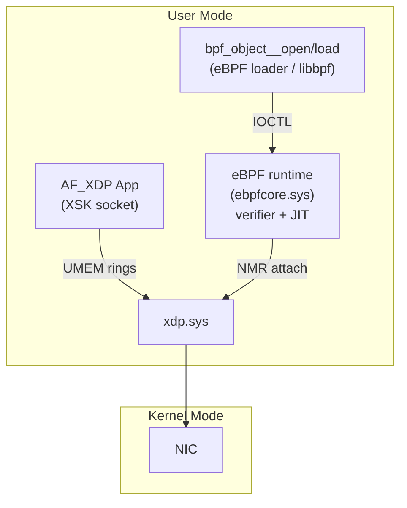

# eBPF Integration Guide

## Overview

XDP for Windows supports
[eBPF](https://ebpf.io/)-based packet processing through integration with the
[eBPF for Windows](https://github.com/microsoft/ebpf-for-windows) project.
eBPF programs offer fully programmable packet inspection, filtering, and
redirection -- replacing the limited built-in rules engine with arbitrary
logic that runs safely inside the Windows kernel.

> **Note:** The built-in rules-based program API (`XDP_RULE`, `XDP_MATCH_TYPE`,
> `XdpCreateProgram`) is deprecated and planned for removal. All users should
> migrate to eBPF programs. See [Migrating from Built-in Rules](#migrating-from-built-in-rules).

### How the Two Projects Fit Together

| Project | Role |
|---------|------|
| **[XDP for Windows](https://github.com/microsoft/xdp-for-windows)** | Provides the high-performance data path: NIC hook points, AF_XDP sockets, shared-memory rings, and the XDP driver (`xdp.sys`). Registers an XDP program type and helper functions with the eBPF runtime. |
| **[eBPF for Windows](https://github.com/microsoft/ebpf-for-windows)** | Provides the eBPF runtime: program verification (PREVAIL verifier), JIT compilation (uBPF), map infrastructure, and the NMR-based extension model that XDP plugs into. |

An eBPF program compiled to BPF bytecode is loaded by the eBPF for Windows
runtime, verified for safety, JIT-compiled to native code, and then attached to
an XDP hook point. The XDP driver invokes the program on every received packet
at wire speed.



## Prerequisites

1. **eBPF for Windows** must be installed first. Follow the
   [eBPF for Windows installation guide](https://github.com/microsoft/ebpf-for-windows/blob/main/docs/InstallEbpf.md).

2. **XDP for Windows** with eBPF support enabled (see [Installation](#installation)).

3. **Clang/LLVM 18.1.8+** for compiling eBPF C programs to BPF bytecode. See the
   [eBPF for Windows development prerequisites](https://github.com/microsoft/ebpf-for-windows/blob/main/docs/GettingStarted.md).

## Installation

### Runtime NuGet Package (v1.3+)

After installing eBPF for Windows:

```powershell
xdp-setup.ps1 -Install xdp
xdp-setup.ps1 -Install xdpebpf
```

### MSI (<= v1.2 only)

Append `ADDLOCAL=xdp_ebpf` to the MSI install command:

```powershell
msiexec.exe /i xdp-for-windows.msi ADDLOCAL=xdp_ebpf /quiet
```

### Developer Setup

Install the eBPF export tool so the eBPF verifier and compiler know about
XDP's program type and helper functions:

```powershell
xdp-setup.ps1 -Install xdpebpfexport
```

Then run the export tool **before** verifying or compiling XDP eBPF programs:

```powershell
xdpbpfexport.exe
```

This populates registry keys (HKCU and/or HKLM) that eBPF for Windows reads to
discover the XDP program type, attach type, context descriptor, and helper
function prototypes.

### Registry Configuration

| Key (under `HKLM\...\Services\xdp`) | Type | Default | Description |
|--------------------------------------|------|---------|-------------|
| `XdpEbpfEnabled` | `DWORD` | `0` | Set to `1` to enable eBPF program attachment. |
| `XdpEbpfMode` | `DWORD` | N/A | `0` = force generic mode; `1` = force native mode. If unset, XDP chooses automatically. |

## XDP Program Type

XDP registers a single eBPF program type with the following identifiers:

| Property | Value |
|----------|-------|
| Program type GUID | `f1832a85-85d5-45b0-98a0-7069d63013b0` |
| Attach type GUID | `85e0d8ef-579e-4931-b072-8ee226bb2e9d` |
| `bpf_prog_type` | `BPF_PROG_TYPE_XDP` |
| ELF section prefix | `xdp` |

### Context: `xdp_md_t`

Every XDP eBPF program receives a pointer to `xdp_md_t` describing the current
packet:

```c
typedef struct xdp_md {
    void *data;               // Pointer to start of packet data (L2 frame).
    void *data_end;           // Pointer to end of packet data.
    uint64_t data_meta;       // Packet metadata (reserved).
    uint32_t ingress_ifindex; // Ingress network interface index.
    uint32_t rx_queue_index;  // RX queue index on the ingress interface.
} xdp_md_t;
```

### Return Values: `xdp_action_t`

The program returns one of the following actions:

```c
typedef enum _xdp_action {
    XDP_PASS     = 1, // Allow the packet to continue up the stack.
    XDP_DROP     = 2, // Drop the packet silently.
    XDP_TX       = 3, // Bounce the packet back out the same NIC.
    XDP_REDIRECT = 4, // Redirect to another target (set by bpf_redirect_map).
} xdp_action_t;
```

### Program Signature

```c
typedef xdp_action_t xdp_hook_t(xdp_md_t *context);
```

## Helper Functions

XDP exposes program-specific helper functions in addition to the
[general eBPF helpers](https://github.com/microsoft/ebpf-for-windows/blob/main/docs/GettingStarted.md)
(e.g., `bpf_map_lookup_elem`, `bpf_map_update_elem`, `bpf_printk`).

### `bpf_redirect_map`

Redirects the current packet to an AF_XDP socket looked up from an XSKMAP.

```c
intptr_t bpf_redirect_map(void *map, uint32_t key, uint64_t flags);
```

| Parameter | Description |
|-----------|-------------|
| `map` | Pointer to a `BPF_MAP_TYPE_XSKMAP` map. |
| `key` | Lookup key (typically `ctx->rx_queue_index`). |
| `flags` | The lower 2 bits specify a fallback `xdp_action_t` to return if the lookup or redirect fails (e.g., `XDP_PASS` or `XDP_DROP`). |

**Returns:** `XDP_REDIRECT` on success, or the fallback action on failure.

See [eBPF Redirect Map (XSKMAP)](ebpf-redirect-map.md) for a comprehensive
guide.

### `bpf_xdp_adjust_head`

Adjusts the packet data start pointer (e.g., to add or remove encapsulation
headers).

```c
int bpf_xdp_adjust_head(xdp_md_t *ctx, int delta);
```

> **Note:** This helper is **not yet implemented**. It currently returns `-1`.

## Writing an XDP eBPF Program

### Minimal Example: Pass All Packets

```c
#include "bpf_helpers.h"
#include "xdp/ebpfhook.h"

SEC("xdp/pass")
int pass(xdp_md_t *ctx) {
    return XDP_PASS;
}
```

### Packet Inspection: Allow Only IPv6

```c
#include "bpf_endian.h"
#include "bpf_helpers.h"
#include "net/if_ether.h"
#include "net/ip.h"
#include "xdp/ebpfhook.h"

SEC("xdp/allow_ipv6")
int allow_ipv6(xdp_md_t *ctx) {
    ETHERNET_HEADER *eth;
    IPV6_HEADER *ipv6;
    const int hdr_size = sizeof(*eth) + sizeof(*ipv6);

    if ((char *)ctx->data + hdr_size > (char *)ctx->data_end) {
        return XDP_DROP;
    }

    eth = (ETHERNET_HEADER *)ctx->data;
    if (eth->Type != htons(ETHERNET_TYPE_IPV6)) {
        return XDP_DROP;
    }

    ipv6 = (IPV6_HEADER *)(eth + 1);
    if (ipv6->Version != 6) {
        return XDP_DROP;
    }

    return XDP_PASS;
}
```

### Selective Drop with Map-Based Configuration

```c
#include "bpf_helpers.h"
#include "xdp/ebpfhook.h"

struct {
    __uint(type, BPF_MAP_TYPE_ARRAY);
    __type(key, uint32_t);
    __type(value, uint32_t);
    __uint(max_entries, 1);
} interface_map SEC(".maps");

struct {
    __uint(type, BPF_MAP_TYPE_ARRAY);
    __type(key, uint32_t);
    __type(value, uint64_t);
    __uint(max_entries, 1);
} dropped_packet_map SEC(".maps");

SEC("xdp/selective_drop")
int selective_drop(xdp_md_t *ctx) {
    uint32_t zero = 0;

    uint32_t *target_ifindex = bpf_map_lookup_elem(&interface_map, &zero);
    if (!target_ifindex) {
        return XDP_PASS;
    }

    if (*target_ifindex == ctx->ingress_ifindex) {
        uint64_t *count = bpf_map_lookup_elem(&dropped_packet_map, &zero);
        if (count) {
            *count += 1;
        }
        return XDP_DROP;
    }

    return XDP_PASS;
}
```

### Redirect to AF_XDP Socket

See [eBPF Redirect Map (XSKMAP)](ebpf-redirect-map.md) for complete examples.

```c
#include "bpf_helpers.h"
#include "xdp/ebpfhook.h"

struct {
    __uint(type, BPF_MAP_TYPE_XSKMAP);
    __type(key, uint32_t);
    __type(value, void *);
    __uint(max_entries, 64);
} xsk_map SEC(".maps");

SEC("xdp/xsk_redirect")
int xsk_redirect(xdp_md_t *ctx) {
    return bpf_redirect_map(&xsk_map, ctx->rx_queue_index, XDP_PASS);
}
```

## Compiling eBPF Programs

eBPF programs are compiled from C source to native Windows kernel drivers
(`.sys` files) using a two-step process. The official eBPF for Windows runtime
only supports loading **native drivers** -- JIT execution of BPF object files
(`.o`) is not officially supported.

### Step 1: Compile to BPF ELF Object

```powershell
clang -g -target bpf -O2 -c my_program.c -o my_program.o
```

### Step 2: Convert to Native Driver

Use the `Convert-BpfToNative.ps1` script from the eBPF for Windows package to
convert the BPF object file into a signed Windows kernel driver:

```powershell
Convert-BpfToNative.ps1 -FileName my_program -IncludeDir <ebpf_include_path> -Platform x64 -Configuration Release -KernelMode $true
```

This produces a `my_program.sys` file that can be loaded by the eBPF runtime.

Ensure the include paths contain the XDP and eBPF headers:
- `xdp/ebpfhook.h` (from the XDP development NuGet package)
- `bpf_helpers.h`, `bpf_endian.h` (from eBPF for Windows)

The ELF section name must start with `xdp` (e.g., `SEC("xdp/my_prog")`).

## Loading and Attaching Programs

Programs are loaded and attached using the eBPF for Windows user-mode APIs
(`libbpf`-compatible or native Windows eBPF APIs). XDP does **not** provide its
own program loading API for eBPF -- the eBPF for Windows runtime handles
verification and attachment.

> **Important:** The official eBPF for Windows runtime only supports loading
> **native drivers** (`.sys` files). JIT execution of BPF object files (`.o`)
> is not officially supported. See [Compiling eBPF Programs](#compiling-ebpf-programs)
> for the compilation workflow.

```c
// Load a native eBPF driver (.sys)
struct bpf_object *obj = bpf_object__open("my_program.sys");
bpf_object__load(obj);
int prog_fd = bpf_program__fd(
    bpf_object__find_program_by_name(obj, "xsk_redirect"));
bpf_xdp_attach(ifIndex, prog_fd, 0, NULL);
```

For AF_XDP redirection, user mode must also populate the XSKMAP with XSK socket
handles after loading the program. See
[eBPF Redirect Map (XSKMAP)](ebpf-redirect-map.md) for the complete workflow.

## Observability

### Performance Counters

XDP exposes per-interface performance counters for eBPF program execution:

| Counter | Description |
|---------|-------------|
| `EbpfXskMapLookupFailures` | `bpf_redirect_map` calls where the XSKMAP key lookup failed. |
| `EbpfXskMapRedirectFailures` | `bpf_redirect_map` calls where the XSK was found but the socket was in an invalid state for redirect. |

### ETW Tracing

eBPF-specific ETW events are emitted for redirect map operations:

| Event | Description |
|-------|-------------|
| `EbpfRedirectMapLookupFailure` | Logged when `bpf_redirect_map` fails to find a key in the XSKMAP. Includes the key and fallback action. |
| `EbpfRedirectMapRedirectFailure` | Logged when the XSK handle was found but `XskCanRedirect` returned false. Includes the key, XSK handle, and fallback action. |
| `EbpfRedirectMapSuccess` | Logged on successful redirect. Includes the key and XSK handle. |

Use the existing XDP tracing infrastructure to capture these events at [Logging](./usage.md#logging).

## Limitations

- **`bpf_xdp_adjust_head` is not implemented** -- returns `-1`.
- **XSKMAP is read-only from eBPF programs** -- user mode must populate the map;
  `bpf_map_lookup_elem`, `bpf_map_update_elem`, and `bpf_map_delete_elem`
  cannot be used on XSKMAPs from within a BPF program.
- **No mixing of eBPF and built-in rules** -- a program is either eBPF or
  rules-based; they cannot be combined on the same queue.
- **Not source-compatible with Linux XDP** -- while the programming model is
  similar, the APIs and headers differ.

## Migrating from Built-in Rules

The built-in rules engine (`XdpCreateProgram` with `XDP_RULE` / `XDP_MATCH_TYPE`
/ `XDP_RULE_ACTION`) is deprecated and planned for removal. All users should
migrate to eBPF programs.

### Migration Quick Reference

| Built-in Rule | eBPF Equivalent |
|---------------|-----------------|
| `XDP_PROGRAM_ACTION_DROP` | Return `XDP_DROP` |
| `XDP_PROGRAM_ACTION_PASS` | Return `XDP_PASS` |
| `XDP_PROGRAM_ACTION_REDIRECT` to XSK | Call `bpf_redirect_map()` with an XSKMAP |
| `XDP_PROGRAM_ACTION_L2FWD` | Return `XDP_TX` (swap MACs in the program) |
| `XDP_MATCH_ALL` | Unconditional return |
| `XDP_MATCH_UDP_DST` | Parse UDP header, compare `dst_port` |
| `XDP_MATCH_IPV4_DST_MASK` | Parse IPv4 header, apply bitmask to `dst_addr` |
| Port set matching | Use a `BPF_MAP_TYPE_HASH` or `BPF_MAP_TYPE_ARRAY` map for port lookups |

### Example: Migrating a UDP Port Filter

**Before (built-in rules):**

```c
XDP_RULE rules[1] = {};
rules[0].Match = XDP_MATCH_UDP_DST;
rules[0].Pattern.Port = htons(4789);
rules[0].Action = XDP_PROGRAM_ACTION_REDIRECT;
rules[0].Redirect.TargetType = XDP_REDIRECT_TARGET_TYPE_XSK;
rules[0].Redirect.Target = xskHandle;

XdpCreateProgram(ifIndex, &hookId, queueId, flags, rules, 1, &program);
```

**After (eBPF):**

```c
#include "bpf_endian.h"
#include "bpf_helpers.h"
#include "net/if_ether.h"
#include "net/ip.h"
#include "xdp/ebpfhook.h"

struct {
    __uint(type, BPF_MAP_TYPE_XSKMAP);
    __type(key, uint32_t);
    __type(value, void *);
    __uint(max_entries, 64);
} xsk_map SEC(".maps");

SEC("xdp/udp_filter")
int udp_filter(xdp_md_t *ctx) {
    void *data = ctx->data;
    void *data_end = ctx->data_end;

    // Parse Ethernet + IPv4 + UDP headers
    ETHERNET_HEADER *eth = data;
    if ((char *)eth + sizeof(*eth) > (char *)data_end) return XDP_PASS;
    if (eth->Type != htons(ETHERNET_TYPE_IPV4)) return XDP_PASS;

    IPV4_HEADER *ip = (IPV4_HEADER *)(eth + 1);
    if ((char *)ip + sizeof(*ip) > (char *)data_end) return XDP_PASS;
    if (ip->Protocol != 17) return XDP_PASS; // UDP

    UDP_HEADER *udp = (UDP_HEADER *)((char *)ip + (ip->HeaderLength * 4));
    if ((char *)udp + sizeof(*udp) > (char *)data_end) return XDP_PASS;

    if (udp->DestinationPort == htons(4789)) {
        return bpf_redirect_map(&xsk_map, ctx->rx_queue_index, XDP_PASS);
    }

    return XDP_PASS;
}
```

## References

- [eBPF Redirect Map (XSKMAP)](ebpf-redirect-map.md)
- [AF_XDP](afxdp.md)
- [eBPF for Windows - Getting Started](https://github.com/microsoft/ebpf-for-windows/blob/main/docs/GettingStarted.md)
- [eBPF for Windows - Installation](https://github.com/microsoft/ebpf-for-windows/blob/main/docs/InstallEbpf.md)
- [Registry Keys](registry-keys.md)
- [Architecture](architecture.md)
