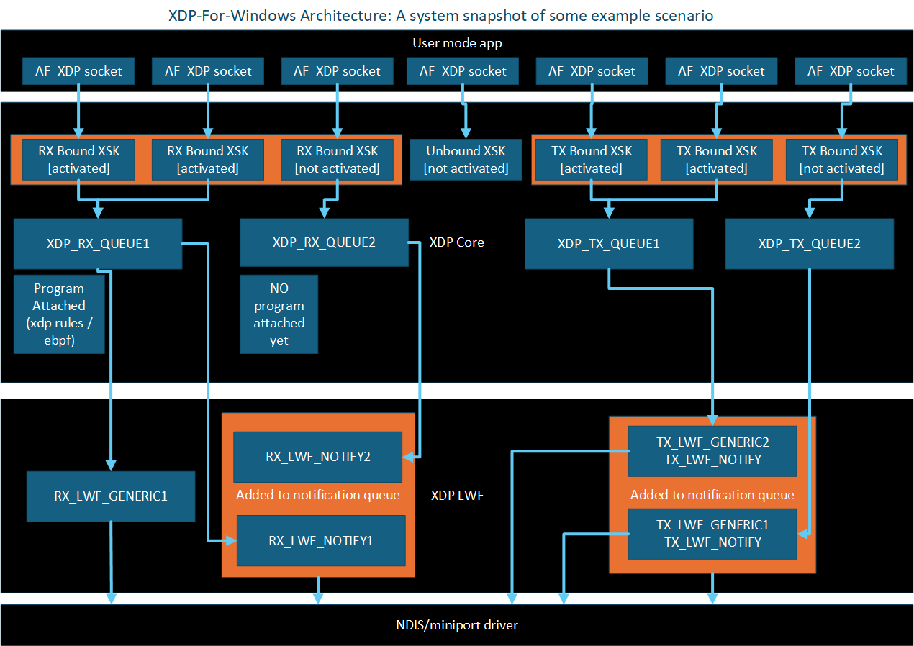

# High level architecture

In this diagram, we show an example scenario where an application has created 7 AF_XDP sockets,
3 of which are bound to the RX path only, 3 are bound to the TX path only, and 1 is unbound.

We show how these sockets are represented in the XDP core layer, and it's interation with various queues.

Note that the at the XDP LWF (light weight filter) layer, only the "Generic" objects are attached to the datapath.
Other objects can subscribe to various NDIS updates. Offload changes, for example, is one such update.

